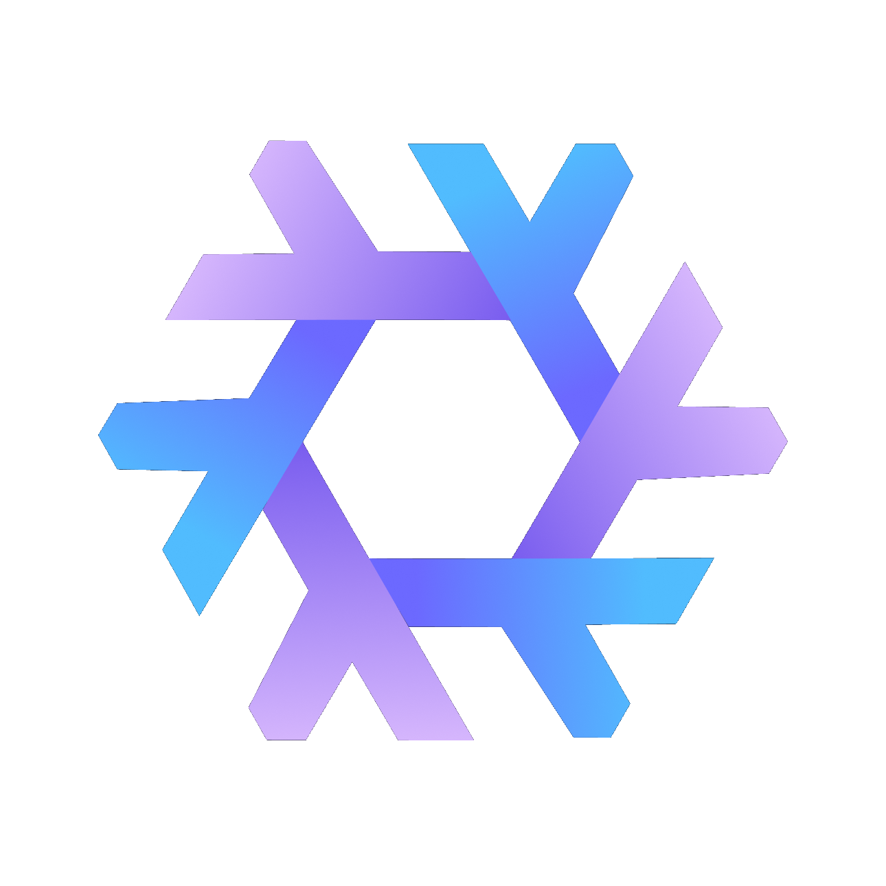

# Robbie's NixOS Configuration

<div align="center">



 A dendritic nix configuration to define immutable desktop and homelab systems with one click installation using flake-parts.

</div>

## 🚀 Features

### Core:
  - 🔒 [Secrets](https://github.com/Mic92/sops-nix)
  - 💾 [Impermanence](https://github.com/nix-community/impermanence)
  - 💽 [Disko](https://github.com/nix-community/disko)
  - 🪝 [Git-hooks](https://github.com/cachix/git-hooks.nix)
  - 🔒 [LUKS disk encryption](https://en.wikipedia.org/wiki/Linux_Unified_Key_Setup)
  - 🪧 [Plymouth boot screen](https://www.freedesktop.org/wiki/Software/Plymouth)
  - 🔃 [Automatic updates](https://github.com/DeterminateSystems/update-flake-lock)
  - 🧹 Garbage collection
  - 📚 Documentation generation

### Desktop
  - 📦 [Flatpak installation](https://github.com/gmodena/nix-flatpak)
  - 🖥️ [KDE Plasma management](https://github.com/nix-community/plasma-manager)
  - 🗔 [Cosmic Desktop management](https://github.com/HeitorAugustoLN/cosmic-manager)
  - 🖌️ [Stylix Theming](https://github.com/nix-community/stylix)
  - 🗄️ [Restic backup](https://restic.net)
  - 🧰 Development tools
  - 🔍 Web browsers
  - 📷 Photo scanning/editing tools
  - 🎮 Game launchers
  - ⚙️ Utilities

### Server
  - 🌐 [K3S](https://k3s.io)
  - ☸️ [Helm](https://helm.sh)
  - 🗃️ [Longhorn](https://longhorn.io)
  - ⚖️ [MetalLB](https://metallb.io)
  - 🏠 [Homepage](https://gethomepage.dev)
  - 📊 [Grafana](https://grafana.com)
  - 🪣 [Gitea](https://about.gitea.com)
  - ☁️ [Nextcloud](https://nextcloud.com)
  - 📼 [Jellyfin](https://jellyfin.org)
  - 🏴‍☠️ [Servarr](https://wiki.servarr.com)

## 🛠️ Usage

### Installation

```bash
# Provision disks
sudo nix run --experimental-features "nix-command flakes" github:nix-community/disko/latest -- --mode destroy,format,mount --flake github:robbiejennings/nix-config#<system>
```

```bash
# Install NixOS
sudo nixos-install --flake github:robbiejennings/nix-config#<system>
```

### Enabling Secrets
Encrypted secrets can be included using sops-nix. This requires the installed system have the necessary SSH keys as defined in `.sops.yaml` located in `/root/.ssh/` for system level secrets and `/home/<username>/.ssh/` for user level secrets.

These secrets can then be edited by generating age keys using `sudo just generate-root-age` or `just generate-user-age`. Each host or user has a single secret file located in the `secrets/` directory of this project. Once these keys are generated secret files can be decrypted using `just edit-secret <filename>`.

With SSH keys and secrets in place, setting `secrets.enable=true` in a configuration will load decrypted secrets on installation whose filepaths are then consumed by various modules in this project.

### Enabling Impermanence
Setting `ìmpermenance.enable = true` in a system configuration will cause the deletion of all files outside the nix store at boot time to ensure a clean environment on every startup. To persist files between boots add their paths to the persistence config option.

### Adding Git Hooks
To add git hooks to your development environment run `just hooks` to enter the default development shell for this project which will automatically add formatting and static code analysis checks. This shell can be exited straight away.

### Generating Options Documentation
To generate markdown documentation of all nixos and home-manager module options in this project run `just docs`. This will output `home-manager-options.md` and `nixos-options.md` into the ``docs/`` directory.

## 📜 References
[flake-parts](https://flake.parts)

[dendritic pattern](https://github.com/mightyiam/dendritic)

[dendritic pattern additional documentation](https://github.com/Doc-Steve/dendritic-design-with-flake-parts/wiki/Dendritic_Aspects)

[defining k3s in pure nix](https://github.com/rorosen/k3s-nix/tree/main)
